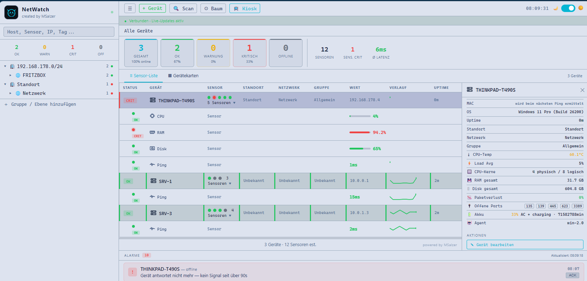
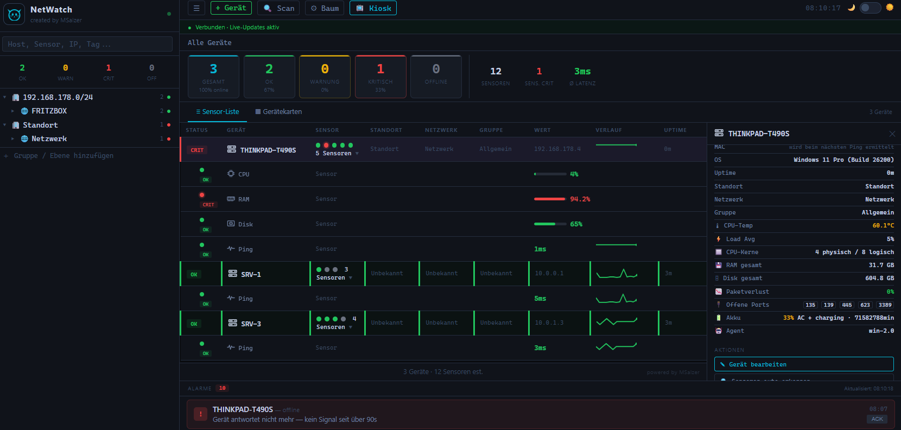
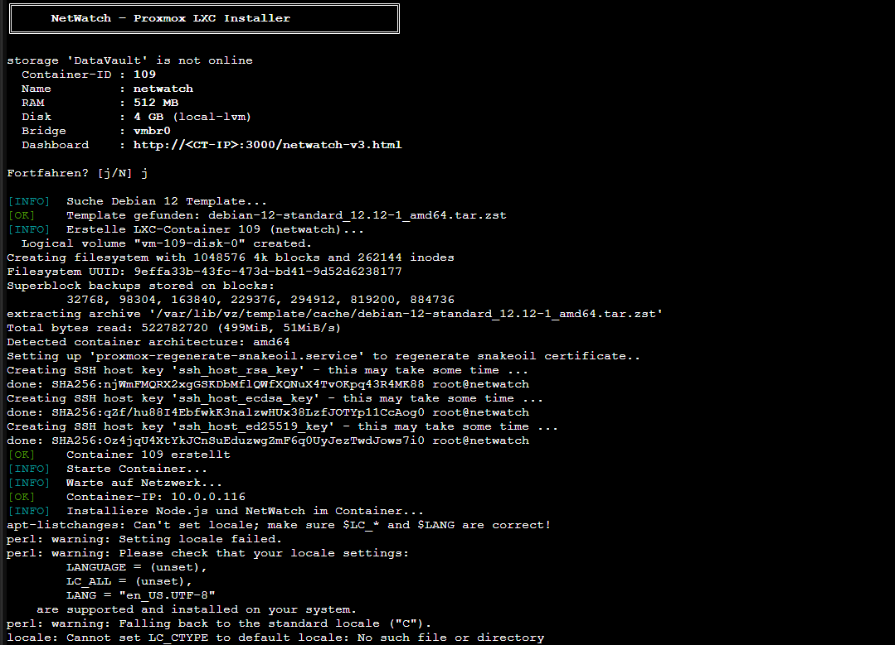
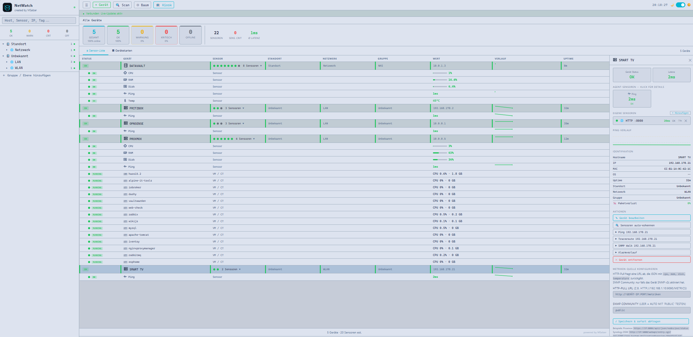

# NetWatch Monitoring

**Projektseite:** [dev.msalzer.dscloud.me/netwatch.html](https://dev.msalzer.dscloud.me/netwatch.html) · **GitHub:** [MSalzer84/netwatch](https://github.com/MSalzer84/netwatch)

Selbst entwickeltes Netzwerk-Monitoring — skalierbar vom Heimnetz bis zur Firmeninfrastruktur. Rechner, Server, NAS, Drucker, USVs, Access Points und Hypervisoren werden in einem Live-Dashboard zusammengefasst. Ähnlich wie Zabbix, aber ohne Lizenzkosten und vollständig unter eigener Kontrolle.

<p>
  
  
</p>

---

## Inhaltsverzeichnis

- [Features](#features)
- [Schnellstart](#schnellstart)
- [Server dauerhaft einrichten](#server-dauerhaft-einrichten)
  - [Windows](#windows)
  - [Linux](#linux)
  - [Linux / Mac — pm2](#linux--mac--pm2)
- [Container-Installation](#container-installation)
  - [Docker — jeder Linux-Host](#docker--jeder-linux-host)
  - [Synology NAS](#synology-nas)
  - [Proxmox](#proxmox)
- [Agents installieren](#agents-installieren)
  - [Windows Agent](#windows-agent)
  - [Linux / Mac Agent](#linux--mac-agent)
  - [Synology NAS Agent](#synology-nas-agent)
- [Geräte einrichten](#geräte-einrichten)
  - [Proxmox vollständig einrichten](#proxmox-vollständig-einrichten)
  - [Hyper-V vollständig einrichten](#hyper-v-vollständig-einrichten)
  - [OPNsense einrichten](#opnsense-einrichten)
  - [FritzBox einrichten](#fritzbox-einrichten)
- [Hypervisor-Integration](#hypervisor-integration)
- [Datenbank & Verlässlichkeit](#datenbank--verlässlichkeit)
- [Schwellwerte](#schwellwerte)
- [Ports](#ports)

---

## Features

| Feature | Beschreibung |
|---|---|
| **Live-Dashboard** | WebSocket-basiert, kein Reload nötig |
| **Geräte-Baum** | Frei benennbar nach Standort, Netzwerk, Gruppe |
| **Sensoren** | CPU, RAM, Disk, Ping, Temperatur, Bandbreite, Batterie, SSL-Zertifikat |
| **Schwellwerte** | Warn & Kritisch individuell pro Sensor einstellbar |
| **Push-Benachrichtigungen** | Über ntfy.sh — kostenlos, keine App-Registrierung nötig |
| **Auto-Discovery** | IP-Bereich scannen, Geräte automatisch erkennen (Hostname, MAC, Hersteller) |
| **Massen-Import** | Nach dem Scan mehrere Geräte auswählen und gemeinsam anlegen |
| **SNMP-Poller** | Drucker, USVs, Switches ohne Agent überwachen |
| **Hypervisor-Integration** | Proxmox, Hyper-V, VMware, XCP-ng, Docker — VMs & Container automatisch erkennen |
| **Kiosk-Modus** | Vollbild mit Echtzeit-Alarmen (Flash, Ton, Browser-Benachrichtigung) |

---

## Schnellstart

### 1 — Node.js installieren

**Windows** (PowerShell als Administrator):
```powershell
winget install OpenJS.NodeJS
```
> Nach der Installation das Terminal **schließen und neu öffnen** — erst dann ist `node` verfügbar.

**Linux / Mac:**
```bash
# Debian/Ubuntu
sudo apt install nodejs npm

# Mac
brew install node
```

---

### 2 — NetWatch herunterladen

```bash
git clone https://github.com/MSalzer84/netwatch.git
cd netwatch
npm install
```

> **Windows:** Pfad `C:\netwatch` empfohlen — alle mitgelieferten Scripts setzen diesen Pfad voraus.

---

### 3 — Server starten (Test)

```bash
node server.js
```

Erfolgreiche Ausgabe:
```
API (Agenten)  -> http://localhost:3000
WebSocket      -> ws://localhost:3001
Dashboard      -> http://localhost:3000/netwatch-v3.html
```

Dashboard im Browser öffnen — eigene Server-IP einsetzen:
```
http://<SERVER-IP>:3000/netwatch-v3.html
```

> Dieser Start dient nur zum Testen. Für den Dauerbetrieb → nächster Abschnitt.

---

## Server dauerhaft einrichten

> Ohne Autostart muss der Server nach jedem Neustart manuell gestartet werden. Dieser Schritt sorgt dafür, dass der Server immer läuft — unsichtbar im Hintergrund, ohne offenes Fenster.

### Windows

Das mitgelieferte Script richtet alles automatisch ein — einmalig als Administrator ausführen:

```powershell
powershell -ExecutionPolicy Bypass -File C:\netwatch\install-server-windows.ps1
```

Das Script:
- Registriert den Server als geplante Aufgabe (läuft als SYSTEM, kein Login nötig, kein Fenster)
- Startet den Server sofort
- Startet ihn bei Absturz automatisch neu

**Status prüfen:**
```powershell
Get-ScheduledTask -TaskName "NetWatch-Server" | Select-Object State
```

**Server neu starten:**
```powershell
Stop-ScheduledTask -TaskName "NetWatch-Server"; Start-ScheduledTask -TaskName "NetWatch-Server"
```

**Task entfernen:**
```powershell
Unregister-ScheduledTask -TaskName "NetWatch-Server" -Confirm:$false
```

---

### Linux

Das mitgelieferte Script richtet den Server als systemd-Dienst ein:

```bash
cd /opt/netwatch
sudo bash install-server-linux.sh
```

**Status prüfen:**
```bash
systemctl status netwatch-server
journalctl -u netwatch-server -f
```

---

### Linux / Mac — pm2

```bash
npm install -g pm2
pm2 start server.js --name netwatch
pm2 save
pm2 startup
```

Den angezeigten Befehl kopieren und ausführen — danach startet pm2 automatisch mit dem System.

---

## Container-Installation

NetWatch läuft als Docker-Container auf Synology NAS, Proxmox und jedem anderen Linux-Host. Die Datenbank wird in einem Volume gespeichert und bleibt bei Updates erhalten.

---

### Docker — jeder Linux-Host

**Voraussetzung:** Docker + Docker Compose installiert.

```bash
git clone https://github.com/MSalzer84/netwatch.git
cd netwatch
docker compose up -d
```

Dashboard sofort erreichbar unter `http://<HOST-IP>:3000/netwatch-v3.html`.

**Nützliche Befehle:**
```bash
docker compose logs -f           # Live-Logs
docker compose restart           # Neustart
docker compose down              # Stoppen
git pull && docker compose up -d # Update
```

> `network_mode: host` in der `docker-compose.yml` gibt dem Container direkten LAN-Zugriff — nötig damit NetWatch andere Geräte per Ping und SNMP erreichen kann.

---

### Synology NAS

> **Hinweis:** Diese Installation wurde noch nicht live getestet. Das Script ist fertig, aber Feedback aus der Praxis fehlt noch. Bei Problemen bitte ein [Issue öffnen](https://github.com/MSalzer84/netwatch/issues).

**Voraussetzung:** Container Manager im Package Center installiert, SSH aktiviert.

Per SSH auf der Synology (als admin):

```bash
sudo bash <(curl -sSL https://raw.githubusercontent.com/MSalzer84/netwatch/main/synology-install.sh)
```

Das Script erledigt alles automatisch:
- Lädt NetWatch nach `/volume1/docker/netwatch/` herunter
- Installiert npm-Abhängigkeiten im Container
- Startet NetWatch als Docker-Container (Autostart nach Reboot aktiv)

Am Ende erscheint die fertige Dashboard-URL:
```
Dashboard → http://<NAS-IP>:3000/netwatch-v3.html
```

**NetWatch aktualisieren:**
```bash
cd /volume1/docker/netwatch && git -C app pull && docker restart netwatch
```

---

### Proxmox

> **Getestet und funktioniert.** Die LXC-Installation wurde erfolgreich auf Proxmox VE getestet.

Ein einziger Befehl auf dem Proxmox-Host (als root) erstellt einen fertigen LXC-Container mit NetWatch:

```bash
bash <(curl -sSL https://raw.githubusercontent.com/MSalzer84/netwatch/main/proxmox-install.sh)
```



Das Script erledigt alles automatisch:
- Lädt das Debian 12 Template herunter (falls nicht vorhanden)
- Erstellt einen LXC-Container (512 MB RAM, 4 GB Disk, 1 CPU)
- Installiert Node.js und NetWatch im Container
- Richtet systemd-Dienst ein (Autostart, Neustart bei Absturz)

Am Ende erscheint die fertige Dashboard-URL und die Zugangsdaten:
```
Dashboard → http://<CT-IP>:3000/netwatch-v3.html

Zugangsdaten Container:
  Benutzer : root
  Passwort : netwatch
```

**Container verwalten (auf dem Proxmox-Host):**
```bash
pct enter <CT-ID>   # Shell im Container öffnen
pct stop  <CT-ID>   # Container stoppen
pct start <CT-ID>   # Container starten
```

**NetWatch aktualisieren (im Container):**
```bash
cd /opt/netwatch && git pull && systemctl restart netwatch-server
```

**Fehlerbehebung — Service startet nicht:**

Falls `systemctl status netwatch-server` den Status `exit-code` zeigt (z.B. nach einer Installation mit einer älteren Script-Version):
```bash
# Im Container ausführen (pct enter <CT-ID> oder per SSH)
sed -i 's|^ExecStart=.*|ExecStart=/usr/bin/node server.js|' /etc/systemd/system/netwatch-server.service
systemctl daemon-reload
systemctl restart netwatch-server
systemctl status netwatch-server
```

> Für die VM-Übersicht in NetWatch zusätzlich den Proxmox API-Token einrichten — siehe [Proxmox vollständig einrichten](#proxmox-vollständig-einrichten).

---

## Agents installieren

Agents laufen auf den überwachten Geräten und senden Metriken (CPU, RAM, Disk, Temperatur …) alle 60 Sekunden an den Server.

---

### Windows Agent

**Einmalig testen:**
```powershell
powershell -ExecutionPolicy Bypass -File C:\netwatch\agents\agent.ps1 -Server http://<SERVER-IP>:3000 -Once
```

**Dauerhaft installieren (Administrator):**
```powershell
powershell -ExecutionPolicy Bypass -File C:\netwatch\agents\install-windows.ps1 -Server http://<SERVER-IP>:3000
```

Das Script richtet eine geplante Aufgabe als SYSTEM ein — startet beim Boot automatisch.

**Hyper-V Agent** (meldet Host + VMs):

Im Browser des Hyper-V-Hosts aufrufen und als Administrator ausführen:
```
http://<SERVER-IP>:3000/download/install-hyperv-agent.bat
```

---

### Linux / Mac Agent

**Einmalig testen:**
```bash
python3 /opt/netwatch/agents/linux-agent.py --server http://<SERVER-IP>:3000 --once
```

**Dauerhaft installieren:**
```bash
curl -sSL http://<SERVER-IP>:3000/install-linux.sh | sudo bash -s -- --server http://<SERVER-IP>:3000
```

Das Script installiert alle Abhängigkeiten und richtet einen systemd-Dienst ein.

---

### Synology NAS Agent

Kein pip, keine Installation nötig — verwendet nur die Python-Standardbibliothek.

**Voraussetzung:** SSH aktivieren — DSM → Systemsteuerung → Terminal & SNMP → SSH-Dienst aktivieren.

**Schritt 1 — Agent herunterladen** (per SSH auf der NAS):
```bash
curl -o ~/synology-agent.py http://<SERVER-IP>:3000/agents/synology-agent.py
```

**Schritt 2 — Testen:**
```bash
python3 ~/synology-agent.py --server http://<SERVER-IP>:3000 --once
```

Erfolgreiche Ausgabe:
```
[OK] CPU:0.5%  RAM:14.6%  Disk:4.4%  Up:33d 18h  Temp:44.4°C
```

**Schritt 3 — Dauerhaft einrichten:**

DSM → Systemsteuerung → Aufgabenplaner → Erstellen → Ausgelöste Aufgabe → Benutzerdefiniertes Script

| Feld | Wert |
|------|------|
| Aufgabenname | NetWatch Agent |
| Benutzer | (dein DSM-Benutzer) |
| Ereignis | Booten |
| Script | `python3 ~/synology-agent.py --server http://<SERVER-IP>:3000` |

Rechtsklick → **Ausführen** — Agent startet sofort und sendet alle 60 Sekunden.

---

## Geräte einrichten

---

### Proxmox vollständig einrichten

Proxmox hat zwei unabhängige Teile:

| Teil | Was es bringt |
|---|---|
| **A — Agent auf dem Host** | CPU, RAM, Disk, Temperatur des Proxmox-Nodes |
| **B — VM-Integration** | Alle VMs und Container mit Status sichtbar |

#### Teil A — Agent auf dem Proxmox-Host

Per SSH auf den Proxmox-Server:

```bash
curl -sSL http://<SERVER-IP>:3000/install-linux.sh | sudo bash -s -- \
  --server http://<SERVER-IP>:3000 \
  --type server \
  --group Proxmox
```

#### Teil B — VM-Integration (API-Token)

**Schritt 1 — API-Token in Proxmox erstellen:**

1. Proxmox Web-GUI: `https://<PROXMOX-IP>:8006`
2. **Datacenter → API Tokens → Add**

| Feld | Wert |
|------|------|
| User | `root@pam` |
| Token ID | `netwatch` |
| Privilege Separation | **deaktivieren** ← wichtig |

Token-Secret kopieren (nur einmal sichtbar). Format:
```
root@pam!netwatch=xxxxxxxx-xxxx-xxxx-xxxx-xxxxxxxxxxxx
```

**Schritt 2 — Token im Dashboard eintragen:**

1. Proxmox-Node im Dashboard anklicken → **Hypervisor / VMs** aufklappen
2. Felder ausfüllen:

| Feld | Wert |
|------|------|
| Typ | `Proxmox VE` |
| URL | `https://<PROXMOX-IP>:8006` |
| Token | `root@pam!netwatch=<token-secret>` |

3. Speichern — VMs erscheinen nach wenigen Sekunden.

> Proxmox verwendet ein selbstsigniertes TLS-Zertifikat — NetWatch akzeptiert dies automatisch.

---

### Hyper-V vollständig einrichten

Der Hyper-V Agent läuft direkt auf dem Windows-Host und liefert Host-Metriken sowie alle VMs — **kein API-Token nötig**.

**Voraussetzungen:** Hyper-V Rolle aktiviert, Agent-Installation als Administrator.

**Schritt 1 — Installer herunterladen:**

Im Browser des Hyper-V-Hosts aufrufen:
```
http://<SERVER-IP>:3000/download/install-hyperv-agent.bat
```

**Schritt 2 — Als Administrator ausführen** (Rechtsklick → „Als Administrator ausführen").

Das Script fragt interaktiv nach Standort, Netzwerk und Gruppe, dann:
1. Lädt `agent.ps1` vom NetWatch-Server herunter
2. Erstellt die geplante Aufgabe „NetWatch-HyperV-Agent" (startet als SYSTEM beim Boot)
3. Startet den Agent sofort

Nach ca. 60 Sekunden erscheint der Host im Dashboard. VMs sind beim Aufklappen des Geräts sichtbar.

**Fehlerbehebung:**
```powershell
# Hyper-V PowerShell-Module prüfen
Get-Command Get-VM

# Falls nicht vorhanden — nachinstallieren:
# Windows Server:
Install-WindowsFeature -Name Hyper-V-PowerShell
# Windows 10/11:
Enable-WindowsOptionalFeature -Online -FeatureName Microsoft-Hyper-V-Management-PowerShell

# Task-Status prüfen:
Get-ScheduledTask -TaskName "NetWatch-HyperV-Agent" | Select-Object State
```

---

### OPNsense einrichten

OPNsense hat keinen NetWatch-Agent — Metriken kommen über **SNMP**.

#### Schritt 1 — SNMP Plugin installieren

1. OPNsense → **System → Firmware → Erweiterungen**
2. „Community-Plugins anzeigen" aktivieren
3. `os-net-snmp` installieren
4. Seite neu laden → **Dienste → Net-SNMP** erscheint in der Sidebar

#### Schritt 2 — SNMP konfigurieren

1. **Dienste → Net-SNMP**
2. Dienst aktivieren
3. **SNMP-Community** eintragen, z. B. `Netwatch` (nicht `public`)
4. **IP-Adressen (eingehend)** — leer lassen (empfohlen)
5. Speichern

> Community-String ist case-sensitiv — exakt gleich im Dashboard eintragen.

#### Schritt 3 — Gerät im Dashboard einrichten

1. Smart Discovery starten — OPNsense wird automatisch erkannt
2. Gerät übernehmen → Typ auf `Firewall` setzen
3. **SNMP Community** eintragen → Speichern

NetWatch fragt jetzt automatisch alle 60 Sekunden CPU, RAM und Disk ab.

#### Schritt 4 — Temperatur-Sensor (optional)

Standard-SNMP liefert keine Temperatur. Einmalig per SSH auf OPNsense:

```sh
# Script erstellen
python3 -c "open('/usr/local/bin/nw_temp.sh','w').write(chr(35)+chr(33)+'/bin/sh\n/sbin/sysctl -n dev.cpu.0.temperature | /usr/bin/sed s/C//\n')"
chmod +x /usr/local/bin/nw_temp.sh

# In SNMP-Template eintragen (überlebt OPNsense-Updates)
echo "content = open('/usr/local/opnsense/service/templates/OPNsense/Netsnmp/snmpd.conf').read()" > /tmp/fix.py
echo "tag = '{' + '% endif %}'" >> /tmp/fix.py
echo "last = content.rfind(tag)" >> /tmp/fix.py
echo "insert = 'extend    nw_temp   /usr/local/bin/nw_temp.sh\n\n'" >> /tmp/fix.py
echo "content = content[:last] + insert + content[last:]" >> /tmp/fix.py
echo "open('/usr/local/opnsense/service/templates/OPNsense/Netsnmp/snmpd.conf', 'w').write(content)" >> /tmp/fix.py
python3 /tmp/fix.py

# Config neu laden
configctl template reload OPNsense/Netsnmp && service snmpd restart
```

Im Dashboard: **Sensor hinzufügen → SNMP → Preset „OPNsense → Temperatur"** auswählen.

> **Nur auf echter Hardware** — in VMs (Proxmox, Hyper-V, VirtualBox) ist kein Temperatursensor verfügbar.

> **SSH danach wieder deaktivieren:** System → Verwaltung → Secure Shell → SSH-Dienst deaktivieren.

**Fehlerbehebung:**

| Problem | Lösung |
|---------|--------|
| SNMP nicht in Sidebar | `os-net-snmp` Plugin installieren, Seite neu laden |
| SNMP antwortet nicht | Dienst aktiv? UDP 161 in der Firewall erlaubt? Community String korrekt? |
| CPU zeigt 0 % | Preset „OPNsense → CPU" im Sensor-Dialog wählen |

---

### FritzBox einrichten

Die FritzBox unterstützt kein SNMP — nur Ping/Erreichbarkeit ist verfügbar.

| Funktion | Verfügbar |
|----------|-----------|
| Ping / Erreichbarkeit | ✅ |
| CPU / RAM / Disk | ❌ |

**Gerät manuell hinzufügen:**

1. Dashboard → **+** → Gerät hinzufügen
2. IP: `192.168.178.1`, Typ: `Router` oder `Firewall`
3. Speichern

Die Smart Discovery erkennt die FritzBox automatisch per Ping.

---

## Hypervisor-Integration

Gerät im Dashboard anklicken → **Hypervisor / VMs** → Typ wählen → Zugangsdaten eintragen → Speichern.



| Hypervisor | Typ | Zugangsdaten | URL |
|---|---|---|---|
| Proxmox VE | `proxmox` | API-Token (`user@pam!tokenid=uuid`) | `https://IP:8006` |
| Proxmox Backup Server | `pbs` | API-Token | `https://IP:8007` |
| Hyper-V | `hyperv` | — (via Agent) | — |
| VMware ESXi / vCenter | `vmware` | `benutzer:passwort` | `https://VCENTER-IP` |
| XCP-ng / XenServer | `xcpng` | `benutzer:passwort` | `https://XCP-HOST` |
| oVirt / RHEV | `ovirt` | `admin@internal:passwort` | `https://OVIRT-ENGINE` |
| Nutanix Prism | `nutanix` | `benutzer:passwort` | `https://IP:9440` |
| Docker Remote API | `docker` | — | `http://IP:2375` |

**Docker Remote API aktivieren** (`/etc/docker/daemon.json`):
```json
{"hosts": ["tcp://0.0.0.0:2375", "unix:///var/run/docker.sock"]}
```
> Port 2375 ist unverschlüsselt — nur im lokalen Netz oder per Firewall absichern.

---

## Datenbank & Verlässlichkeit

Alle Daten (Geräte, Metriken, Konfiguration) liegen in einer SQLite-Datei:

| Betriebssystem | Pfad |
|---|---|
| Windows | `C:\netwatch\netwatch.db` |
| Linux / Docker | `/opt/netwatch/netwatch.db` (oder Volume) |

Die Datenbank bleibt bei Neustarts und Updates erhalten — solange die Datei nicht gelöscht wird.

**Backup erstellen:**
```powershell
# Windows
Copy-Item C:\netwatch\netwatch.db C:\netwatch\netwatch_backup.db
```
```bash
# Linux
cp /opt/netwatch/netwatch.db /opt/netwatch/netwatch_backup.db
```

| Szenario | Ergebnis |
|---|---|
| Server neu gestartet, Autostart eingerichtet | ✅ Läuft automatisch weiter |
| Server neu gestartet, kein Autostart | ❌ Manuell starten nötig |
| Server abgestürzt, pm2 / Task / systemd aktiv | ✅ Wird automatisch neu gestartet |
| `netwatch.db` gelöscht | ❌ Alle Daten verloren |

---

## Schwellwerte

| Sensor | Warnung | Kritisch |
|--------|---------|----------|
| CPU | ≥ 75 % | ≥ 90 % |
| RAM | ≥ 80 % | ≥ 90 % |
| Disk | ≥ 80 % | ≥ 90 % |
| Ping | ≥ 50 ms | ≥ 150 ms |
| Temperatur | ≥ 75 °C | ≥ 85 °C |

Schwellwerte sind im Dashboard unter **Einstellungen** global anpassbar. Pro Sensor können individuelle Warn- und Kritisch-Werte gesetzt werden.

---

## Ports

| Port | Protokoll | Verwendung |
|------|-----------|-----------|
| 3000 | HTTP | Dashboard, API, Agent-Daten |
| 3001 | WebSocket | Live-Updates im Browser |

---

## Autor

MSalzer — [github.com/MSalzer84](https://github.com/MSalzer84)
